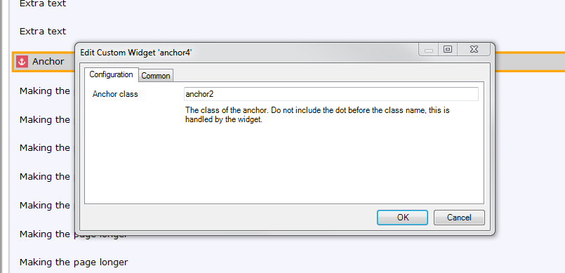

# ScrollToAnchor
Allows you to scroll to an anchor on a Mendix page. 
The ScrollToAnchor widget contains 3 seperate widgets designed to make it easy to position an anchor and scroll to a section based on a variable or non variable.

## ScrollToAnchor
The scroll to anchor allows you to use a variable to define which anchor on the page to scroll to. All Anchors must be placed above the ScrollToAnchor to Work.

### Properties
#### Scroll To
This property accepts a attribute for the class that you wish to use to scroll to. This value should be one of the class names of the anchors placed above the scroll to widget. You do not need to include the dot for the class name, simply add to the attribute the class you wish to scroll to. For example you may have an anchor above your scroll to widget set up like so:

</img>

In your attribute you should store "anchor2" as the class name to scroll to.

#### Region to Scroll
This is the scrollable section that you want to use to scroll to the anchor. The default that is used in this widget is:
`.region-content .mx-scrollcontainer-wrapper`

The reason is because I have assumed that most people by standard are using the ux framework and scrolling per region.

If your layouts are set up to scroll full page then place the following in the field:
`html, body`

If you are using different layout setups and scrolling, try to use a html inspector to find the section you want to scroll.

#### Offset
This property allows you to add a integer to move the scroller further higher than the top of the anchor, so that your position is further up the page.

#### Scroll Option
This property allows you to trigger when the scroll behaviour will occur. You can either decide to trigger it on load, on change of a object, on a attribute change, on validation or all of the previous. 

## ScrollToAnchorWithoutContext
This widget is the same as the one above, the only difference is that it doesn't need to be placed in a dataview and the attribute to scroll to can be hard coded in the modeller. This means you don't need to use an attribute to store where to scroll to.

## Anchor
This widget allows you to dictate where the scrolltoanchor will scroll to. This widget should always be placed above the scrollToAnchor widgets.
### Properties
#### Anchor Class
This property will accept a string for the class you want to assign this anchor. This class will be needed in the scrolll to property on the scrolltoanchorwidget.
